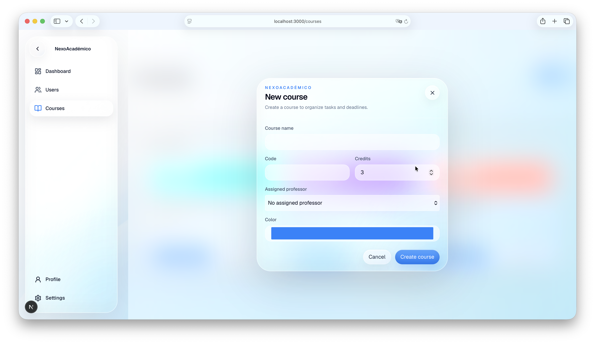
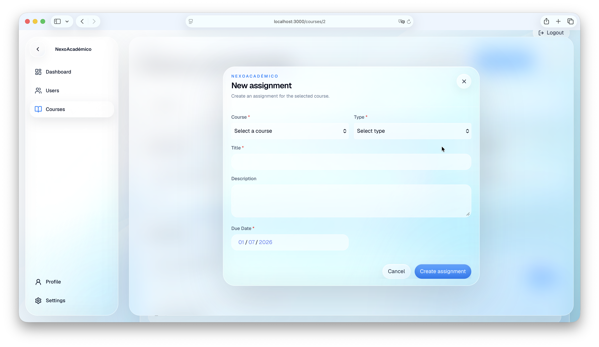
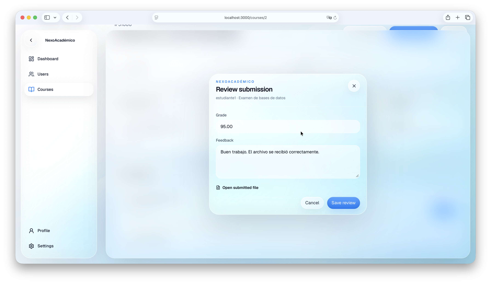

# NexoAcadémico

<p align="center">
  <strong>Plataforma full stack para la gestión académica universitaria</strong>
</p>

<p align="center">
  
  
  
  
  
  
  
</p>

NexoAcadémico es una plataforma web full stack para administrar cursos, matrículas, actividades, entregas y seguimiento del rendimiento universitario. Implementa control de acceso para administradores, profesores y estudiantes mediante una API REST con Django y una interfaz moderna construida con Next.js.

> Proyecto académico desarrollado para el curso **Lenguajes para Aplicaciones Comerciales** de la Universidad de Costa Rica.

<p align="center">
  
</p>

## Características principales

- Autenticación por token y registro de estudiantes.
- Roles diferenciados para administrador, profesor y estudiante.
- Administración de usuarios por parte del rol administrador.
- Creación de cursos y asignación de profesores.
- Matrícula de estudiantes en cursos.
- Gestión de actividades con prioridad, estado, progreso, fecha límite, peso y calificación.
- Búsqueda, filtros y ordenamiento de actividades.
- Adjuntos, entregas de archivos y comentarios.
- Revisión, retroalimentación y calificación de entregas.
- Dashboard con indicadores académicos y próximas actividades.
- Estadísticas de rendimiento y carga académica.
- Eliminación lógica y trazabilidad mediante historial de actividades.
- Interfaz adaptable con materiales translúcidos y animaciones con Framer Motion.

## Capturas

| Autenticación | Dashboard administrativo |
|---|---|
|  |  |

| Cursos | Detalle del curso |
|---|---|
|  |  |

| Actividades | Revisión de entregas |
|---|---|
|  |  |

| Crear curso | Crear actividad |
|---|---|
|  |  |

<p align="center">
  
</p>

## Arquitectura

```text
Browser
   |
   v
Next.js 16 + React 19
   |
   | HTTP / JSON + Token Authentication
   v
Django 6 + Django REST Framework
   |
   v
MySQL 8
```

```text
nexoacademico/
├── backend/
│   ├── apps/
│   │   ├── accounts/          # Autenticación y administración de usuarios
│   │   └── academic/          # Cursos, actividades, matrículas y entregas
│   ├── config/                # Configuración principal de Django
│   ├── database/              # Scripts y procedimientos de base de datos
│   ├── manage.py
│   └── requirements.txt
├── frontend/
│   ├── public/
│   ├── src/
│   │   ├── app/               # Rutas de Next.js App Router
│   │   ├── components/        # UI, navegación y componentes de dominio
│   │   ├── hooks/             # Hooks reutilizables
│   │   ├── lib/               # Cliente API, constantes y motion tokens
│   │   ├── services/          # Servicios de autenticación y dominio
│   │   ├── styles/            # Tokens y materiales visuales
│   │   └── types/             # Tipos TypeScript
│   └── package.json
└── docs/                      # Documentación técnica y capturas
```

Más detalle en [Arquitectura](docs/architecture.md).

## Tecnologías

### Frontend

- Next.js 16.2
- React 19.2
- TypeScript 5
- Tailwind CSS 4
- Framer Motion 12
- Lucide React

### Backend

- Python
- Django 6.0
- Django REST Framework 3.17
- DRF Token Authentication
- django-cors-headers
- PyMySQL
- Pillow

### Base de datos

- MySQL 8 con codificación `utf8mb4`
- Migraciones administradas por Django ORM
- Restricciones únicas, índices y relaciones con integridad referencial

## Requisitos

- Python 3.12 o posterior compatible con Django 6
- Node.js 20 o posterior
- npm 10 o posterior
- MySQL 8

## Instalación local

### 1. Clonar el repositorio

```bash
git clone https://github.com/aleariasr/nexoacademico.git
cd nexoacademico
```

### 2. Configurar el backend

```bash
cd backend
python -m venv .venv
source .venv/bin/activate
pip install -r requirements.txt
cp .env.example .env
```

En Windows PowerShell:

```powershell
.venv\Scripts\Activate.ps1
```

Configura `backend/.env`:

```env
SECRET_KEY=replace-with-a-secure-secret-key
DEBUG=True
ALLOWED_HOSTS=localhost,127.0.0.1
DB_NAME=nexoacademico_db
DB_USER=root
DB_PASSWORD=your-password
DB_HOST=127.0.0.1
DB_PORT=3306
```

Crea la base de datos:

```sql
CREATE DATABASE nexoacademico_db
CHARACTER SET utf8mb4
COLLATE utf8mb4_unicode_ci;
```

Ejecuta las migraciones y crea un administrador:

```bash
python manage.py migrate
python manage.py createsuperuser
python manage.py runserver
```

El backend estará disponible en `http://127.0.0.1:8000`.

### 3. Configurar el frontend

En otra terminal:

```bash
cd frontend
cp .env.example .env.local
npm ci
npm run dev
```

Configura `frontend/.env.local`:

```env
NEXT_PUBLIC_API_URL=http://127.0.0.1:8000/api/v1
```

La interfaz estará disponible en `http://localhost:3000`.

## Roles y permisos

| Función | Administrador | Profesor | Estudiante |
|---|:---:|:---:|:---:|
| Administrar usuarios | Sí | No | No |
| Crear cursos | Sí | No | No |
| Ver cursos asignados | Sí | Sí | Sí |
| Matricular estudiantes | Sí | Sí, en sus cursos | No |
| Crear actividades | Sí | Sí, en sus cursos | No |
| Entregar actividades | No | No | Sí |
| Revisar y calificar entregas | Sí | Sí, en sus cursos | No |
| Consultar dashboard y estadísticas | Sí | Sí | Sí |

## API

La API utiliza el prefijo:

```text
/api/v1/
```

Ejemplo de autenticación:

```bash
curl -X POST http://127.0.0.1:8000/api/v1/auth/login/ \
  -H "Content-Type: application/json" \
  -d '{"username":"demo","password":"your-password"}'
```

Las solicitudes autenticadas deben enviar:

```http
Authorization: Token YOUR_TOKEN
```

Principales recursos:

| Recurso | Ruta |
|---|---|
| Autenticación | `/api/v1/auth/` |
| Cursos | `/api/v1/courses/` |
| Matrículas | `/api/v1/enrollments/` |
| Tipos de actividad | `/api/v1/task-types/` |
| Actividades | `/api/v1/tasks/` |
| Entregas | `/api/v1/submissions/` |
| Dashboard | `/api/v1/dashboard/` |
| Estadísticas | `/api/v1/statistics/` |

Consulta [Referencia de la API](docs/api.md).

## Calidad y verificación

### Frontend

```bash
cd frontend
npm ci
npm run lint
npx tsc --noEmit
npm run build
```

### Backend

```bash
cd backend
python manage.py check
python manage.py test
```

## Seguridad

- Las credenciales y secretos se cargan mediante variables de entorno.
- Los archivos `.env` no deben versionarse.
- La API exige autenticación de forma predeterminada.
- Los querysets se filtran según el rol y la relación del usuario con el curso.
- Las actividades se eliminan de forma lógica para conservar trazabilidad.
- Los archivos cargados en `backend/media/` son datos de ejecución y no deben incluirse en Git.

Consulta [Seguridad y configuración](docs/security.md).

## Documentación

- [Arquitectura](docs/architecture.md)
- [Instalación y configuración](docs/setup.md)
- [Referencia de la API](docs/api.md)
- [Modelo de datos](docs/database.md)
- [Seguridad y configuración](docs/security.md)

## Estado del proyecto

El sistema se encuentra funcional para fines académicos y de demostración.

Antes de un despliegue en producción se recomienda ampliar la cobertura de pruebas automatizadas, incorporar documentación OpenAPI, utilizar almacenamiento externo para archivos, implementar expiración o rotación de tokens y separar la configuración por ambiente.

## Licencia

Este proyecto se distribuye bajo la [Licencia MIT](LICENSE).
